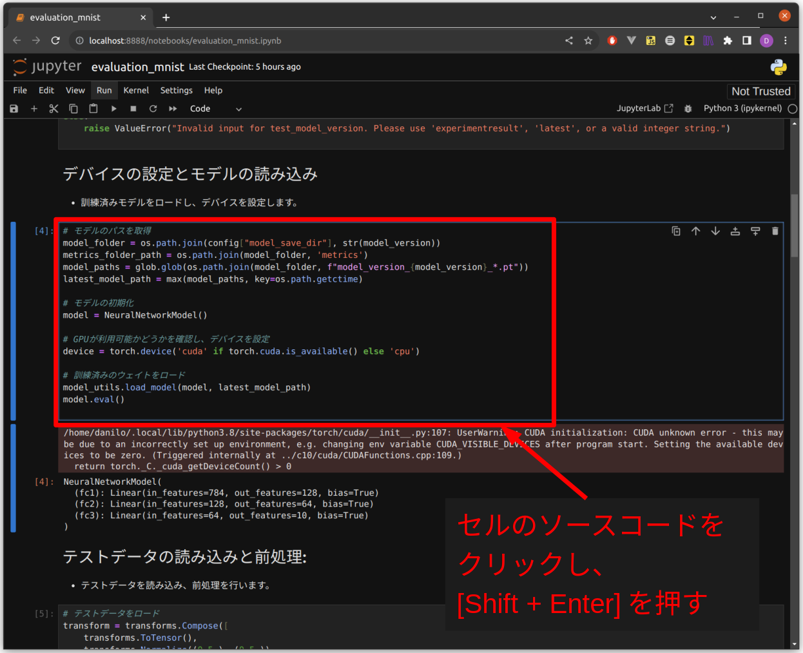

<!-- omit in toc -->
# コード実行手順書 
## コーディング課題：MNISTデータセットに対するディープラーニング学習と評価

## 1. ドキュメント作成者

ギマレンス　ゴンサルベス　ダニロ(daniloguimaraes71@gmail.com)

## 2. 改訂履歴

- 1.0:
  - 作成日時: 2023-08-23 13:48:45
  - 更新内容: 初版作成

## 3. このドキュメントの目次

- [1. ドキュメント作成者](#1-ドキュメント作成者)
- [2. 改訂履歴](#2-改訂履歴)
- [3. このドキュメントの目次](#3-このドキュメントの目次)
- [4. このドキュメントの目的・概要](#4-このドキュメントの目的概要)
- [5. 前提条件](#5-前提条件)
- [6. 準備](#6-準備)
    - [6.1. ソースコード準備](#61-作業完了条件)
    - [6.2. コンフィグファイルの設定](#62-作業完了条件)
- [7. 手順](#7-手順)
    - [7.1. 訓練コードの実行](#71-訓練コードの実行)
    - [7.2. テストコードの実行](#72-テストコードの実行)
    - [7.3. 評価コードを実行](#73-評価コードを実行)
- [8. 出力の詳細](#8-出力の詳細)
    - [8.1. ログを確認する](#81-ログを確認する)
    - [8.2. 出力データフォーマット](#82-出力データフォーマット)
        - [8.2.1. モデルウェイト](#82-モデルウェイト)
        - [8.2.2. メトリクスファイルの保存](#82-メトリクスファイルの保存)

## 4. このドキュメントの目的・概要

このドキュメントは、MNISTデータセットに対するディープラーニングの学習と評価の手順について説明します。プロジェクトの実行には、コーディング課題として提供されたソースコードを使用します。手順に従って、データの準備、モデルの訓練、テスト、評価を進めることができます。

このドキュメントでは、以下の内容について説明します。

- 前提条件：ドキュメントの利用に必要な前提条件を説明します。
- 準備：ソースコードとコンフィグファイルの準備方法について詳細を説明します。
- 手順：訓練コードの実行、テストコードの実行、評価コードの実行手順を段階的に示します。
- 出力の詳細：ログの確認方法や出力データフォーマットに関する情報を提供します。

プロジェクトの目的は、MNISTデータセットを使用してディープラーニングモデルを訓練し、その性能を評価することです。このドキュメントを通じて提供される手順とガイドラインに従いながら、コードの実行と評価を行うことができます。プロジェクトの成功基準や評価方法を理解し、モデルの訓練と評価に関する作業をスムーズに進めることができます。

また、このドキュメントはコーディング課題に取り組む際に参考となる情報や手順を提供するためのものです。プロジェクトの実行に必要な情報を整理し、ステップバイステップのガイドを提供することで、プロジェクトの進行を支援します。

## 5. 前提条件

このドキュメントを効果的に活用するには、以下の前提条件を満たしていることが必要です。

- Python: プロジェクトの実行にはPythonプログラミング言語が必要です。Python 3.8のバージョンが推奨されます。

- インターネット接続: MNISTデータセットのダウンロードにインターネット接続が必要です。

- ターミナル: コマンドラインインターフェースを使用してソースコードの実行とプロジェクトの操作を行うため、ターミナルを利用できる必要があります。

- ソースコード: プロジェクトのソースコードが提供されている必要があります。ソースコードはプロジェクトの機能を実行するための基盤となります。

- コンフィグファイル: プロジェクトの設定を調整するためのコンフィグファイル（`config.json`）が必要です。

これらの前提条件を確認してから、ドキュメント内の手順に従ってプロジェクトを進めてください。詳細な手順と情報は後続のセクションで提供されます。

  **注:_**  完全な環境構築ガイドについては、ソースコードと一緒に提供される「環境構築」ファイルをご確認ください。

## 6. 準備

### 6.1．ソースコードの準備と展開

1. ソースコードのダウンロード：
   - プロジェクトのソースコードを適当な場所にダウンロードします。

2. ソースコード展開：
   - ターミナルを開き、プロジェクトフォルダに移動します。
     ```console
     $ cd [プロジェクトフォルダのパス]
     ```
   - ソースコードを展開します。
     ```console
     $ unzip -o source_code.zip
     ```

### 6.2．コンフィグファイルの設定

- プロジェクトフォルダで`config/config.json`ファイルをテキストエディタで開きます。
- 以下のパラメーターを調整します。各設定はプロジェクトの要件に合わせて調整します。

```json
{
    "batch_size": [バッチサイズ],
    "learning_rate": [学習率],
    "epochs": [エポック数],
    "log_dir": "[ログの保存先]",
    "model_save_dir": "[モデルの保存先]"
}
```
パラメーターの詳細：

| パラメタ名       | 説明                                                         |
| --------------- | ------------------------------------------------------------ |
| `batch_size`    | バッチサイズ：訓練やテスト時に使用するバッチのサイズ。 |
| `learning_rate` | 学習率：モデルの重みを更新する際のステップサイズ。            |
| `epochs`        | エポック数：訓練データ全体を何回使用するかを指定する回数。 |
| `log_dir`       | ログの保存先：訓練の進捗や結果を保存するログファイルのディレクトリ。 |
| `model_save_dir`| モデルの保存先：訓練後のモデルの重みを保存するディレクトリ。 |

## 7. 手順

このセクションでは、MNIST認識のディープラーニングモデルを訓練し、テスト、評価するための手順を説明します。本章は以下の3つのサブセクションに分かれています。。

- **7.1. 訓練コードの実行**: ここでは、ディープラーニングモデルの訓練を行うための手順を説明します。MNISTデータセットを使用してモデルを訓練するためのコードの実行方法が解説されています。

- **7.2. テストコードの実行**: このセクションでは、訓練済みモデルをテストするための手順を説明します。テストデータを使用してモデルの性能を評価するためのコードの実行方法が詳しく説明されています。

- **7.3. 評価コードを実行**: 訓練とテストが終了した後、モデルの評価を行うための手順について説明します。Jupyter Notebookを使用して訓練およびテストの結果を視覚化し、モデルの性能を分析する方法が解説されています。

**注:_**  本章で紹介されるターミナルコマンドは、プロジェクトフォルダ内で実行する必要があります。プロジェクトフォルダ内に移動するために、以下のコマンドを使用してください。

```console
$ cd [プロジェクトフォルダのパス]
```

### 7.1. 訓練コードの実行

1. 訓練コードの実行：

```console
$ python3 main.py --mode train
```

- 訓練中にはログ情報がターミナルに表示されます。
- 訓練の進行状況や各エポックごとの訓練損失が表示されます。
- 出力例)
  ```console
  2023-08-24 17:47:37,622 [INFO] Device: cuda
  2023-08-24 17:47:37,622 [INFO] Training started...
  2023-08-24 17:47:46,328 [INFO] Epoch [1/10], Average Loss: 0.4081
  2023-08-24 17:47:54,337 [INFO] Epoch [2/10], Average Loss: 0.1966
  2023-08-24 17:48:02,412 [INFO] Epoch [3/10], Average Loss: 0.1445
  2023-08-24 17:48:10,547 [INFO] Epoch [4/10], Average Loss: 0.1168
  2023-08-24 17:48:18,573 [INFO] Epoch [5/10], Average Loss: 0.0998
  2023-08-24 17:48:26,689 [INFO] Epoch [6/10], Average Loss: 0.0882
  2023-08-24 17:48:34,794 [INFO] Epoch [7/10], Average Loss: 0.0766
  2023-08-24 17:48:42,937 [INFO] Epoch [8/10], Average Loss: 0.0698
  2023-08-24 17:48:51,047 [INFO] Epoch [9/10], Average Loss: 0.0615
  2023-08-24 17:48:59,152 [INFO] Epoch [10/10], Average Loss: 0.0570
  2023-08-24 17:48:59,153 [INFO] Training completed.
  2023-08-24 17:48:59,153 [INFO] Model weights of version 1 saved in path ../outputs/saved_models/1/
  ```

2. 訓練結果の保存パス：
- 訓練が完了すると、訓練済みモデルが以下のディレクトリに保存されます。
  ```
  [プロジェクトフォルダのパス]/outputs/saved_models/[モデルバージョン]
  ```
- 訓練損失ファイル`training_losses.json`が以下のディレクトリに保存されます。
  ```
  [プロジェクトフォルダのパス]/outputs/saved_models/[モデルバージョン]/metrics/training_losses.json
  ```

  **注:_**  詳細な出力内容やログのフォーマットについて、[8. 出力の詳細](#8-出力の詳細)をご確認ください。

### 7.2. テストコードの実行

1. テストコードの実行：
- 特定のモデルバージョンを選択してテストする場合：
  ```console
  $ python3 main.py --mode test --model_version [モデルバージョン]
  ```
- 最新のモデルバージョンを使用してテストする場合：
  ```console
  $ python3 main.py --mode test
  ```
- 出力例)
  ```console
  2023-08-24 17:49:46,161 [INFO] Testing started...
  2023-08-24 17:49:46,161 [INFO] Model Version 1
  2023-08-24 17:49:47,790 [INFO] Model epoch 1 - Test Accuracy: 0.9273 Test loss: 0.2481
  2023-08-24 17:49:49,081 [INFO] Model epoch 2 - Test Accuracy: 0.9519 Test loss: 0.1568
  2023-08-24 17:49:50,391 [INFO] Model epoch 3 - Test Accuracy: 0.9572 Test loss: 0.1419
  2023-08-24 17:49:51,673 [INFO] Model epoch 4 - Test Accuracy: 0.9633 Test loss: 0.1167
  2023-08-24 17:49:52,948 [INFO] Model epoch 5 - Test Accuracy: 0.9647 Test loss: 0.1121
  2023-08-24 17:49:54,233 [INFO] Model epoch 6 - Test Accuracy: 0.9676 Test loss: 0.1091
  2023-08-24 17:49:55,495 [INFO] Model epoch 7 - Test Accuracy: 0.9679 Test loss: 0.0958
  2023-08-24 17:49:56,757 [INFO] Model epoch 8 - Test Accuracy: 0.9719 Test loss: 0.0901
  2023-08-24 17:49:58,020 [INFO] Model epoch 9 - Test Accuracy: 0.9716 Test loss: 0.0925
  2023-08-24 17:49:59,281 [INFO] Model epoch 10 - Test Accuracy: 0.9722 Test loss: 0.0965
  2023-08-24 17:49:59,281 [INFO] Testing for all weights completed.
  ```

2. テスト結果の保存パス：
- テスト損失ファイル`test_losses.json`とテスト精度ファイル`test_accuracy.json`が以下のディレクトリに保存されます。
  ```
  [プロジェクトフォルダのパス]/outputs/saved_models/[モデルバージョン]/metrics/`
  ```

  **注:_**  詳細な出力内容やログのフォーマットについて、[8. 出力の詳細](#8-出力の詳細)をご確認ください。

### 7.3. 評価コードを実行

1. **Jupyter Notebook を起動：**
- ターミナルで、以下のコマンドを実行して Jupyter Notebook を起動します。
  ```console
  $ python3 -m notebook
  ```

2. **ブラウザでアクセス：**
- Jupyter Notebook を起動した後、デフォルトのウェブブラウザが自動的に開かれ、Jupyter のダッシュボードが表示されます。ダッシュボードからNotebookファイルの`evaluation_mnist.ipynb`をダブルクリックし、Notebookを開きます。

- 例)


3. **コードセルの実行：**
- 自動的に新しいタブでNotebookが開かれます。順番にセルを選択し、 Shift キーを押しながら Enter キーを押すと、セルが実行されます。

- 例)



4. **セルの実行結果を確認：**
- セル内のコードが実行された後、その実行結果がセルの下に表示されます。出力結果やエラーメッセージが表示されることがあります。

- 例)


5. **ノートブックの保存と閉じる：**
作業が終わったら、ノートブックを保存しましょう。

- ノートブックの上部メニューから「File」をクリックし、保存オプションを選択します。
- ノートブックを閉じるには、「File」から「Close and Halt」を選択します。

- 例)


6. **シャットダウンと終了：**
Jupyter Notebook を終了するには、ターミナルで Ctrl + C を押して、Notebook サーバーを停止します。

## 8. 出力の詳細

このセクションでは、プログラムの実行結果と生成される出力データの詳細について説明します。プロジェクトの進捗、モデルの評価、およびトラブルシューティングに役立つ情報がここに含まれています。以下のフォルダツリーは、出力フォルダ内のファイルとディレクトリの構造を示しています。

出力保存ディレクトリ構成例)

```
[プロジェクトフォルダのパス]
└── outputs
   ├── logs
   │   └── output.log
   └── saved_models
       └── 1
           ├── metrics
           │   ├── test_accuracy.json
           │   ├── test_losses.json
           │   └── training_losses.json
           ├── model_version1_epoch10_2023-08-23_17-02-24.pt
           ├── model_version1_epoch1_2023-08-23_17-01-14.pt
           ├── model_version1_epoch2_2023-08-23_17-01-22.pt
           ├── model_version1_epoch3_2023-08-23_17-01-30.pt
           ├── model_version1_epoch4_2023-08-23_17-01-38.pt
           ├── model_version1_epoch5_2023-08-23_17-01-45.pt
           ├── model_version1_epoch6_2023-08-23_17-01-53.pt
           ├── model_version1_epoch7_2023-08-23_17-02-01.pt
           ├── model_version1_epoch8_2023-08-23_17-02-09.pt
           └── model_version1_epoch9_2023-08-23_17-02-16.pt
```

本章は以下の2つのサブセクションに分かれています。

- **8.1. ログの確認方法**: プログラムの実行中に生成されるログファイルに含まれる情報の解釈と利用方法について説明します。

- **8.2. 出力データフォーマット**: 生成される出力データのフォーマットと内容について説明します。モデルウェイトの保存方法やメトリクスファイルの意味について理解するためのガイドを提供します。

### 8.1. ログの確認方法

- 訓練およびテストの実行中に生成されるログは、`outputs/logs/output.log`ファイルに保存されます。
- 以下のコマンドを使用して、ターミナルでログを表示できます。

```console
$ cat outputs/logs/output.log
```

- ログは実行の詳細な情報を提供し、エラーや問題のトラブルシューティングに役立ちます。

以下の表は、ログファイル`(outputs/logs/output.log)`に含まれる情報の一般的な内容を示しています。ログは、実行中の詳細情報やトラブルシューティングの際に参考になる情報が含まれています。

| 情報の種類               | 説明                                                                       |
| ----------------------- | -------------------------------------------------------------------------- |
| エポックごとの進行状況   | 各エポックでの訓練とテストの進行状況、精度、損失などの情報が表示されます。 |
| モデルの保存と読み込み   | モデルの保存と読み込みに関する情報が表示され、特定のエポックでのモデルの保存場所やファイル名が記録されます。 |
| エラーメッセージや警告   | 実行中に発生したエラーメッセージや警告が表示され、問題の特定と解決に役立つ情報が提供されます。 |
| 実行中のプロセスに関する情報 | 実行中のさまざまなプロセスに関する情報が表示されます。これには、データの読み込み、モデルの訓練などが含まれます。 |

ログファイルの中身の例)

```
2023-08-24 17:47:37,622 [INFO] Device: cuda
2023-08-24 17:47:37,622 [INFO] Training started...
2023-08-24 17:47:46,328 [INFO] Epoch [1/10], Average Loss: 0.4081
2023-08-24 17:47:54,337 [INFO] Epoch [2/10], Average Loss: 0.1966
2023-08-24 17:48:02,412 [INFO] Epoch [3/10], Average Loss: 0.1445
2023-08-24 17:48:10,547 [INFO] Epoch [4/10], Average Loss: 0.1168
2023-08-24 17:48:18,573 [INFO] Epoch [5/10], Average Loss: 0.0998
2023-08-24 17:48:26,689 [INFO] Epoch [6/10], Average Loss: 0.0882
2023-08-24 17:48:34,794 [INFO] Epoch [7/10], Average Loss: 0.0766
2023-08-24 17:48:42,937 [INFO] Epoch [8/10], Average Loss: 0.0698
2023-08-24 17:48:51,047 [INFO] Epoch [9/10], Average Loss: 0.0615
2023-08-24 17:48:59,152 [INFO] Epoch [10/10], Average Loss: 0.0570
2023-08-24 17:48:59,153 [INFO] Training completed.
2023-08-24 17:48:59,153 [INFO] Model weights of version 1 saved in path ../outputs/saved_models/1/
2023-08-24 17:49:46,161 [INFO] Testing started...
2023-08-24 17:49:46,161 [INFO] Model Version 1
2023-08-24 17:49:47,790 [INFO] Model epoch 1 - Test Accuracy: 0.9273 Test loss: 0.2481
2023-08-24 17:49:49,081 [INFO] Model epoch 2 - Test Accuracy: 0.9519 Test loss: 0.1568
2023-08-24 17:49:50,391 [INFO] Model epoch 3 - Test Accuracy: 0.9572 Test loss: 0.1419
2023-08-24 17:49:51,673 [INFO] Model epoch 4 - Test Accuracy: 0.9633 Test loss: 0.1167
2023-08-24 17:49:52,948 [INFO] Model epoch 5 - Test Accuracy: 0.9647 Test loss: 0.1121
2023-08-24 17:49:54,233 [INFO] Model epoch 6 - Test Accuracy: 0.9676 Test loss: 0.1091
2023-08-24 17:49:55,495 [INFO] Model epoch 7 - Test Accuracy: 0.9679 Test loss: 0.0958
2023-08-24 17:49:56,757 [INFO] Model epoch 8 - Test Accuracy: 0.9719 Test loss: 0.0901
2023-08-24 17:49:58,020 [INFO] Model epoch 9 - Test Accuracy: 0.9716 Test loss: 0.0925
2023-08-24 17:49:59,281 [INFO] Model epoch 10 - Test Accuracy: 0.9722 Test loss: 0.0965
2023-08-24 17:49:59,281 [INFO] Testing for all weights completed.
```

### 8.2 出力データフォーマット

このセクションでは、プログラムの実行結果および生成されるメトリクスファイルの詳細について説明します。これにより、モデルの性能評価や進捗状況の確認が容易になります。

#### 8.2.1. モデルウェイト

訓練およびテストの結果として、訓練済みのモデルが自動的に保存されます。これらのモデルは、各エポックの終了後に生成され、学習中のモデル状態を反映しています。

##### 8.2.1.1. モデルウェイトの保存パス

モデルウェイトの保存場所は、以下のディレクトリ内です。

`outputs/saved_models/[モデルバージョン]`

##### 8.2.1.2. モデルウェイト命名規則

生成される各モデルファイルは、モデルのバージョン、エポック番号、および保存日時に基づいた命名規則に従います。以下の表は、モデルファイルの命名規則の例を示しています。

| ファイル名                                                | 例                                          |
|-----------------------------------------------------------|---------------------------------------------|
| model_version[モデルバージョン]_epoch[エポック番号]_[日付]_[時刻].pt | model_version1_epoch1_2023-08-18_17-06-18.pt |

#### 8.2.2. メトリクスファイル

訓練およびテストのメトリクス（損失値と精度）は、各エポックごとに計算され、メトリクスファイルに保存されます。これにより、モデルの学習や評価の進行状況を可視化できます。

##### 8.2.2.1. モデルの保存パス
メトリクスファイルは、以下のディレクトリ内に保存されます。

`outputs/saved_models/[モデルバージョン]/metrics`

##### 8.2.2.2. メトリクスファイルの詳細
以下のメトリクスファイルが生成されます。

| ファイル名               | 内容                                       |
|--------------------------|-------------------------------------------|
| test_accuracy.json       | 各エポックにおけるテスト精度。            |
| test_losses.json         | 各エポックにおけるテスト損失。            |
| training_losses.json     | 各エポックにおける訓練損失。      |

これらのファイルは、モデルの性能評価や学習の進行状況を定量的に分析するための貴重な情報源です。

##### 8.2.2.3. メトリクスファイルの例示
以下は、メトリクスファイルの内容の一部の例です。

- test_accuracy.json
```json
{
    "epoch_1": 0.92,
    "epoch_2": 0.94,
    "epoch_3": 0.95,
    ...
}
```

- test_losses.json
```json
{
    "epoch_1": 0.30,
    "epoch_2": 0.25,
    "epoch_3": 0.20,
    ...
}
```

- training_losses.json
```json
{
    "epoch_1": 0.15,
    "epoch_2": 0.10,
    "epoch_3": 0.08,
    ...
}
```